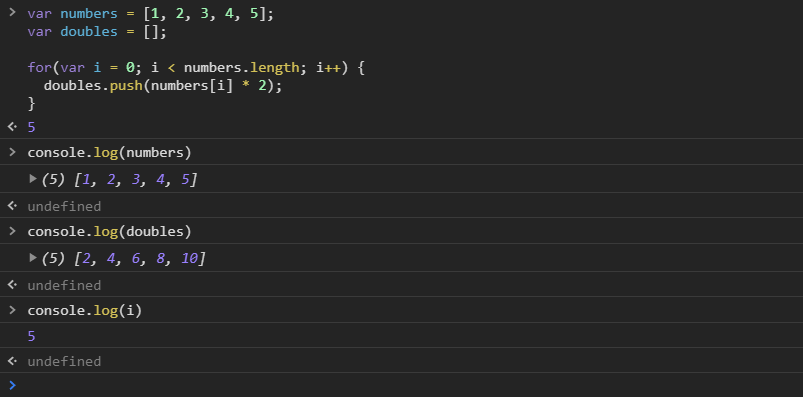
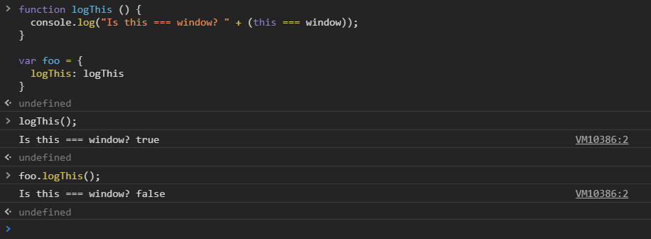

[`Programación con JavaScript`](../../Readme.md) > [`Sesión 01`](../Readme.md) > `Ejemplo 01`

---

## Ejemplo 1: Scope y This 

### Objetivos
1.- Diferenciar el scope local de una función con el scope de condicionales y ciclos.
2.- Diferenciar el valor de `this` en una función y en un método
3.- Implementar el método `call` para cambiar el contexto de `this`
### Objetivo 1 Sentencias de bloque
#### Requisitos

En una nueva carpeta vamos a crear un archivo `HTML` en blanco llamado `index.html`:

```html
<html>
  <head>
    <meta charset="utf-8"/>
    <title>Sesion Uno</title>
  </head>
  <body>
    <script type="text/javascript" src="./ejemplo-1.js"></script>
  </body>
</html>
```

Dentro de la misma carpeta creamos un archivo `ejemplo-1.js` que es donde
se trabajará este ejemplo. Finalmente abre el archivo `index.html`
en Chrome e inspecciona la consola para ver los resultados.

#### Desarrollo

Cuando agrupamos una o varias sentencias dentro de un par de llaves decimos que tenemos Block Statements
o bloque de sentencias. Esto lo usamos todo el tiempo, en funciones por ejemplo, lo usamos para
delimitar el cuerpo de la función. También lo usamos en condicionales como `if/else` o `switch`, e incluso
en bucles como `for` o `while`.

Tiene sentido pensar que cada bloque de sentencias crea un scope local, de hecho este es el caso de las
funciones. Sin embargo, no pasa así en condicionales o bucles.

```javascript
if(true) {
  var name = "John Doe";
  
  console.log(name); // "John Doe"
}

console.log(name); // "John Doe"
```

En esta sentencia `if` estamos declarando una nueva variable `name`, la cual forma parte del scope global,
es por ello que podemos acceder a esta variable fuera del `if`. Lo mismo pasa con los bucles.

```javascript
var numbers = [1, 2, 3, 4, 5];
var doubles = [];

for(var i = 0; i < numbers.length; i++) {
  doubles.push(numbers[i] * 2);
}

console.log(numbers); // [1, 2, 3, 4, 5]
console.log(doubles); // [2, 4, 6, 8, 10]
```

En este ejemplo estamos usando un ciclo `for` para crear un nuevo arreglo que contiene el doble de cada
elemento en el arreglo `numbers`. Además de eso, inconscientemente hemos creado una variable global que
seguirá con vida a lo largo del código.

```javascript
console.log(i); // 5
```

Cuando inicializamos `i` lo hicimos con el único propósito de utilizar esa variable como parte del `for`.
No es necesario seguir teniendo esa variable en el scope global, de hecho podría causar algún problema más
adelante en el código si usamos `i` nuevamente pensando que no tiene ningún valor. 



> Más adelante se aborda una alternativa a `var i = 0`


[`Programación con JavaScript`](../../Readme.md) > [`Sesión 01`](../Readme.md) > ` This`

---


### Objetivo 2 This como metodo

#### Requisitos

vamos a crear un archivo `Js` en blanco llamado `this.js`:

```html
   <script type="text/javascript" src="./this.js"></script>
```
#### Desarrollo

Ya vimos que por default `this` hace referencia a la global `window`.

```javascript
console.log(this); // Window { … }
```

Aun cuando `this` se encuentre dentro de una función sigue apuntando a la global `window`.

```javascript
function foo() {
  console.log(this); 
}
foo(); // Window { … }
```

La situación cambia cuando una función es ejecutada como método de un objeto. Veamos un ejemplo:

```javascript
function logThis () {
  console.log("Is this === window? " + (this === window));
}

var foo = {
  logThis: logThis
}

logThis(); // Is this === window? true

foo.logThis(); // Is this === window? false
```

Cuando ejecutamos `logThis()` directamente `this` sigue haciendo referencia a `window`. Al llamar
`logThis()` como método de un objeto el valor de `this` cambia, ahora hace referencia al objeto que 
lo contiene, en este caso el objeto `foo`.



[`Programación con JavaScript`](../../Readme.md) > [`Sesión 01`](../Readme.md) > ` Call`

---


### Objetivo 3 Usando  `call`


#### Requisitos

En un archivo `Js` en blanco llamado `call.js`:

```html
<html>
  <head>
    <meta charset="utf-8"/>
    <title>Ejemplo 3: Usando call</title>
  </head>
  <body>
    <h1>Sesión 1</h1>
    <ul>
      <li>¿Qué es scope?</li>
      <li>Scope global</li>
      <li>Scope local</li>
      <li>Execution context</li>
      <li>¿Cuál es el valor de this?</li>
      <li>This en nuevas instancias</li>
      <li>Cambiar el contexto de this</li>
    </ul>
    <script type="text/javascript" src="./call.js"></script>
  </body>
</html>
```

#### Desarrollo

En el `HTML` tenemos una lista no ordenada con los temas vistos en esta sesión. Vamos a empezar
seleccionando todos estos elementos del DOM. 

```javascript
var listItems = document.querySelectorAll('ul li');
```

El método `querySelectorAll()` devuelve un `NodeList`, una colección de nodos estática con todos 
los elementos que coincidan con el selector indicado. Recuerda que este selector es un selector de CSS,
por lo que `ul li` está seleccionando todos los `li` que se encuentren dentro de un `ul`.

Ahora usaremos un ciclo `for` para recorrer cada elemento de `listItems`

```javascript
for (var i = 0; i < listItems.length; i++) {
  // Code goes here...
}
```

Por último, vamos a mostrar en consola el texto dentro de cada elemento con `innerText` pero vamos a envolver
el `console.log()` dentro de una IIFE para poder usar el método `call` y definir el contexto de `this`.

```javascript
(function () {
  console.log(this.innerHTML);
}).call(listItems[i]);
```

En cada iteración del ciclo `this` hace referencia al nodo completo de `listItems[i]`.

```javascript
var listItems = document.querySelectorAll('ul li');

for (var i = 0; i < listItems.length; i++) {
  (function () {
    console.log(this.innerText);
  }).call(listItems[i]);
}
```


