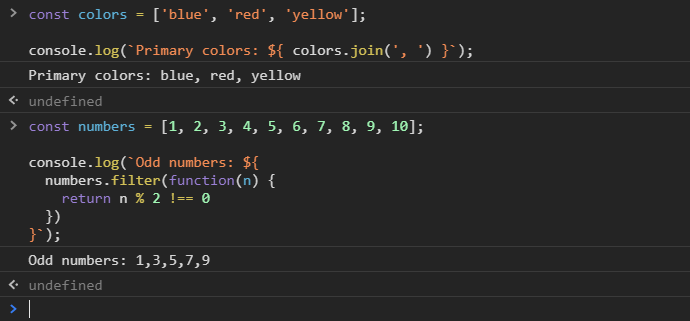
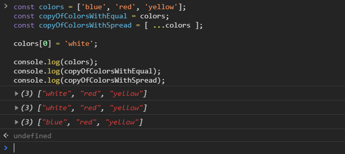
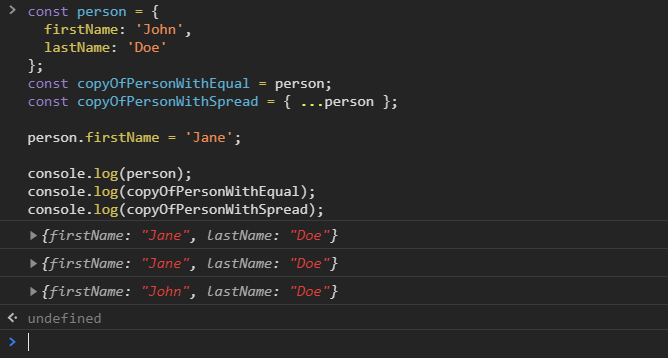
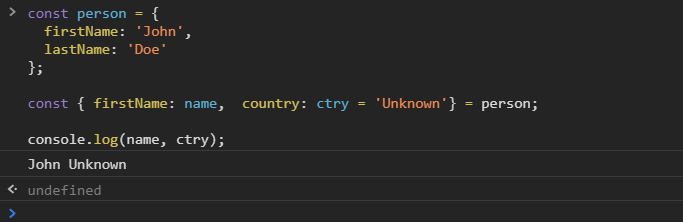

[`Programación con JavaScript`](../../Readme.md) > [`Sesión 02`](../Readme.md) > `Ejemplo 02`

---

##  ES6

### Objetivos

1.- Diferenciar la nueva sintaxis para trabajar con strings.
2.- Implementar el spread operator para copiar arreglos y objetos.
3.- Extraer propiedades de un objeto mediante asignación por destructuring.

## Objetivo 1 Strings en ES6

#### Requisitos

En una nueva carpeta vamos a crear un archivo `HTML` en blanco llamado `index.html`:

```html
<html>
  <head>
    <meta charset="utf-8"/>
    <title>ES6</title>
  </head>
  <body>
    <script type="text/javascript" src="./StringES6.js"></script>
  </body>
</html>
```

Dentro de la misma carpeta creamos un archivo `StringES6.js.js` que es donde
se trabajará este ejemplo. Finalmente abre el archivo `index.html`
en Chrome e inspecciona la consola para ver los resultados.

#### Desarrollo

Normalmente si queremos agregar el valor de una variable a una cadena de texto debemos concatenar ambos con el signo +
y siempre tener cuidado de agregar espacios en blanco para que no salgan ambos textos juntos. Si usamos comillas
invertidas podemos incluir variables dentro del string.

```javascript
// ES5
const name = 'John Doe';

console.log("Welcome " + name); // Welcome John Doe

// ES6
const name = 'John Doe';

console.log(`Welcome ${ name }`); // Welcome John Doe
```

Estas plantillas hacen más fácil crear cadenas de string con múltiples líneas.

```javascript
const message = `Welcome Back!
John Doe
`;

console.log( message ); 
// Welcome Back!
// John Doe
```

Además de variables también podemos usar expresiones matemáticas.

```javascript
const a = 10;
const b = 20;

console.log(`a + b = ${a + b}`); // a + b = 30 
```

Trabajar con arreglos.

```javascript
const colors = ['blue', 'red', 'yellow'];

console.log(`Primary colors: ${ colors.join(', ') }`); // Primary colors: blue, red, yellow
```

O incluso funciones de alto orden.

```javascript
const numbers = [1, 2, 3, 4, 5, 6, 7, 8, 9, 10];

console.log(`Odd numbers: ${ 
  numbers.filter(function(n) { 
    return n % 2 !== 0 
  }) 
}`); // Odd numbers: 1,3,5,7,9
```




## Objetivo 2 Copiar arreglos y objetos

#### Requisitos

En un archivo `Js` en blanco llamado `copy.js`:

```html
   <script type="text/javascript" src="./copy.js"></script>
```

#### Desarrollo

Cuando usamos el operador de asignación (`=`) para copiar un arreglo, los valores primitivos siguen apuntando a la misma
referencia por lo que cambios en un arreglo afectan al otro.

```javascript
const colors = ['blue', 'red', 'yellow'];
const copyOfColors = colors;

console.log(colors); // ["blue", "red", "yellow"]
console.log(copyOfColors); // ["blue", "red", "yellow"]

colors[0] = 'white';

console.log(colors); // ["white", "red", "yellow"]
console.log(copyOfColors); // ["white", "red", "yellow"]
```

La ventaja de usar el spread operator es que se crea una nueva referencia a los valores primitivos, por lo que cambios 
en el original no afectan la copia.

```javascript
const colors = ['blue', 'red', 'yellow'];
const copyOfColorsWithEqual = colors;
const copyOfColorsWithSpread = [ ...colors ];

colors[0] = 'white';

console.log(colors); // ["white", "red", "yellow"]
console.log(copyOfColorsWithEqual); // ["white", "red", "yellow"]
console.log(copyOfColorsWithSpread); // ["blue", "red", "yellow"]
```



Lo mismo sucede con los objetos.

```javascript
const person = {
  firstName: 'John',
  lastName: 'Doe'
};
const copyOfPersonWithEqual = person;
const copyOfPersonWithSpread = { ...person };

person.firstName = 'Jane';

console.log(person); // ["white", "red", "yellow"]
console.log(copyOfPersonWithEqual); // ["white", "red", "yellow"]
console.log(copyOfPersonWithSpread); // ["blue", "red", "yellow"]
```




## Objetivo 3 Object destructuring

#### Requisitos

En  un archivo `Js` en blanco llamado `destructuring.js`:

```html
    <script type="text/javascript" src="./destructuring.js"></script>
 ```
#### Desarrollo

Si la propiedad que queremos extraer no existe en el objeto se retorna `undefined`. Podemos usar asignar un valor por 
default en caso de no encontrar la propiedad que buscamos. Para esto debemos asignar (`=`) un valor dentro de las llaves.

```javascript
const person = {
  firstName: 'John',
  lastName: 'Doe'
};

const { firstName, country = 'Unknown' } = person;

console.log(firstName, country); // John Unknown
```

En ocasiones no queremos usar el mismo nombre de la propiedad del objeto, por ejemplo cuando estamos consumiendo 
información de un recurso externo o de una base de datos. Usando `:` podemos renombrar una variable.

```javascript
const person = {
  firstName: 'John',
  lastName: 'Doe'
};

const { firstName: name } = person;

console.log(name); // John 
```

La asignación de un valor default y el cambio de nombre de la variable se pueden mezclar para casos de usos un poco más
complejos.

```javascript
const person = {
  firstName: 'John',
  lastName: 'Doe'
};

const { firstName: name,  country: ctry = 'Unknown'} = person;

console.log(name, ctry); // John Unknown
```

