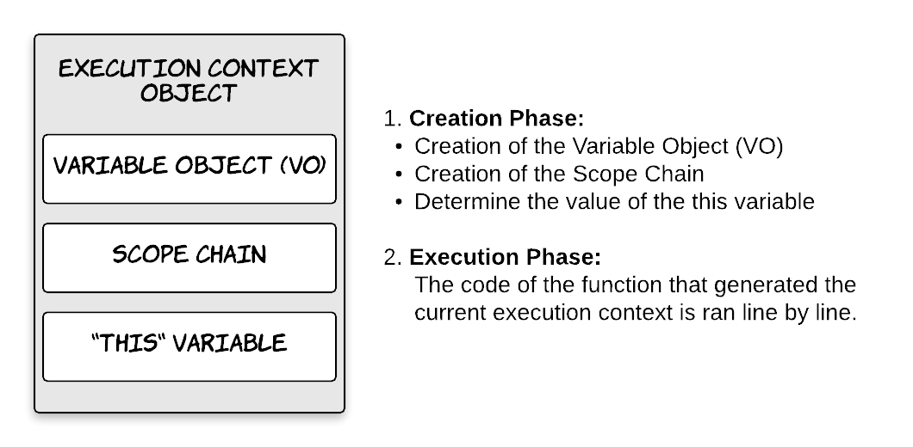
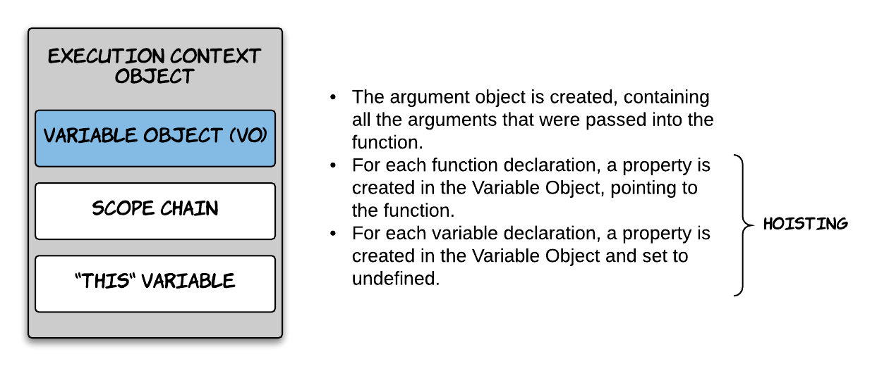
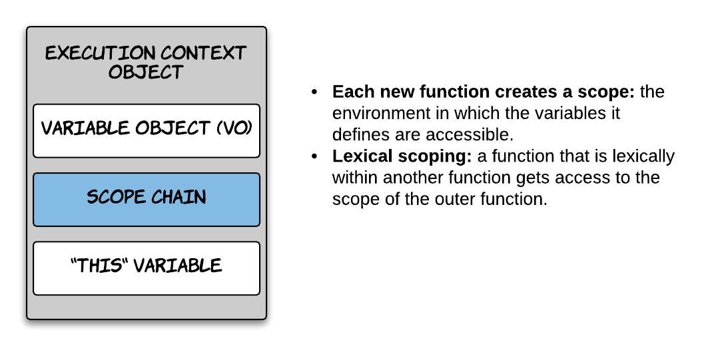
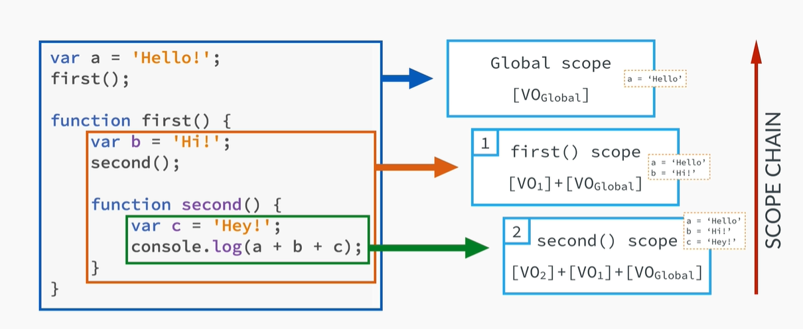
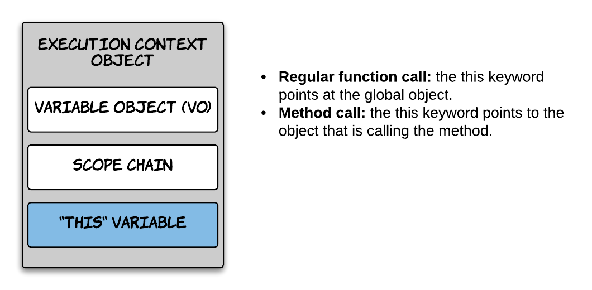

## Postwork

### Objetivos

Diferenciar Scope de Context y entender a detalle el Execution Context

Implementar _for...of_ sobre iterables.

Diferenciar el uso de arrow functions sobre funciones regulares.

## _Scope de Context_

Diferenciar Scope de Context y entender a detalle el Execution Context
### Desarrollo

Scope, Context y Execution Context son conceptos que muy fácilmente se confunden entre sí por lo que es bastante 
complejo entender la diferencia y cómo funcionan cuando estamos aprendiendo JavaScript. Ya vimos que _Scope_ se refiere 
al alcance que tienen las variables, es decir, limita desde dónde podemos acceder a una variable. Por otro lado, 
_Context_ se refiere al valor que tiene `this` el cual cambia en distintas circunstancias como ya vimos anteriormente. 
Ahora veamos a detalle cómo funciona el _Execution Context_.

---

### Execution Context a detalle

En la sesión vimos al Execution Context como una caja que envuelve variables donde parte de nuestro código es evaluado 
y ejecutado. Podemos asociar el Execution Context con un objeto que tiene tres propiedades: **Variable Object**, el 
cual contiene los argumentos de la función, declaraciones de variables internas y declaraciones de funciones. 
**Scope Chain**, este contiene el Variable Object del Execution Context actual así como el de los padres. Por último la 
variable **this**.

   

Empecemos con lo que ya sabemos. Cuando una función es llamada un nuevo Execution Context se coloca encima del 
Execution Stack y esto sucede en dos fases. La fase de creación que básicamente es crear o inicializar las propiedades 
descritas más arriba: Variable Object, Scope Chain y `this`. La segunda fase es la fase de ejecución, aquí se ejecuta 
el código de la función línea por línea.

---

### Variable Object



Cuando se crea el Variable Object se genera un objeto que contiene todos los argumentos que se pasaron a la función. 
Después, por cada declaración de función se crea una nueva propiedad dentro del VO que apunta a la función en sí. Por 
último, por cada declaración de variable se crea una propiedad en el VO y se inicializa la variable como `undefined`.

Los últimos dos pasos es lo que se conoce como Hoisting. En este punto aún no llegamos a la fase de ejecución, es decir,
el código de nuestra función aún no se ejecuta, sin embargo, ya tenemos acceso a las funciones y las variables son 
inicializadas con `undefined`.

---

### Scope Chain



En esta fase se crea un nuevo scope por cada función. Además del scope global y el scope local que vimos durante la 
sesión, existe el scope léxico. Toda función que se encuentre dentro de otra función tiene acceso al scope de la 
función más externa.



De esta forma la función `second` tiene acceso tanto al scope de la función `first` como el scope global. Por lo tanto 
tiene acceso a las variables `a` y `b`. 

---

### `this` variable



Por último se determina cuál será el valor de `this`. Cuando hablamos de llamadas de funciones regulares, `this` apunta 
al objeto global `window` en caso de los navegadores y `global` para el caso de Node.js. Cuando hablamos de un método 
entonces `this` apunta al objeto que está llamando el método.

Es importante tomar en cuenta que a `this` no se le asigna valor alguno hasta que la función que lo define es ejecutada. 


##  _for...of_

Implementar _for...of_ sobre iterables.

### Desarrollo

Cuando trabajamos con arreglos lo más seguro es que debemos realizar alguna operación donde tengamos que recorrer cada 
elemento de dicho arreglo. Para esto lo más probable es que decidamos utilizar un bucle `for`, por ejemplo, si queremos 
mostrar en consola todos los elementos de un arreglo.

```javascript
const numbers = [1, 2, 3, 4, 5];

for (let i = 0; i < numbers.length; i++) {
  console.log(numbers[i]);
}
```

En ocasiones no queremos o no necesitamos un contador cuando solo deseamos ejecutar una función por cada elemento del 
arreglo. Para estos casos otra alternativa es usar el método `forEach`, el cual hace justo eso, ejecutar una función 
por cada elemento del arreglo.

```javascript
const numbers = [1, 2, 3, 4, 5];

numbers.forEach(function(number) {
  console.log(number);
});
```

Una desventaja de usar `forEach` es que no podemos implementar `break` o `continue` para saltarnos una iteración o 
salir del bucle. Tomando el mismo ejemplo anterior, si queremos saltarnos el número 3 lo podemos hacer de la siguiente 
manera:

```javascript
const numbers = [1, 2, 3, 4, 5];

for (let i = 0; i < numbers.length; i++) {
  if(numbers[i] === 3) continue;
  console.log(numbers[i]);
}
```

ES6 introduce la sentencia _for...of_, esta es una combinación entre `for` y `forEach` ya que nos permite ejecutar un 
bloque de código para cada elemento de un _objeto iterable_. Es decir, funciona con arreglos, strings y otros objetos 
similares a un arreglo como `NodeList`. Similar a `forEach`, en cada iteración se crea una variable que corresponde al 
elemento del arreglo por lo que no necesitamos hacer algo como `numbers[i]`.

```javascript
const numbers = [1, 2, 3, 4, 5];

for (let number of numbers) {
  console.log(number);
}
```

También podemos manipular las iteraciones con `break` o `continue`.

```javascript
const numbers = [1, 2, 3, 4, 5];

for (let number of numbers) {
  if(number === 3) continue;
  console.log(number);
}
```

---

### Ejercicios

#### Suma de un rango

Crear una función `range` que recibe tres argumentos, `start`, `end` y `step`. La función debe retornar un arreglo que 
contenga todos los números desde `start` hasta `end`. El tercer argumento `step` es opcional, y nos indica el número de 
incrementos para crear el arreglo. Si no se recibe este argumento el incremento debe ser de uno en uno. `step` puede 
ser negativo, en este caso en lugar de incrementar los números el arreglo debería ir disminuyendo los números.

Por último escribir una función `sum` que reciba un arreglo de enteros y retorne la suma de todos los números.

```javascript
function range(start, end, step) {
  // Code goes here
}

function sum(array) {
  // Code goes here
}

console.log( range(1, 5) ); // [1, 2, 3, 4, 5]

console.log( range(1, 10, 2) ); // [1, 3, 5, 7, 9]

console.log( range(5, 2, -1) ); // [5, 4, 3, 2]

console.log( sum(range(1, 10)) ); // 55
```

<details>
  <summary>Solución</summary>

```javascript
function range(start, end, step) {
  if(!step) {
    step = start < end ? 1 : -1
  }

  let array = [];

  if (step > 0) {
    for (let i = start; i <= end; i += step) array.push(i);
  } else {
    for (let i = start; i >= end; i += step) array.push(i);
  }
  
  return array;
}

function sum(array) {
  let total = 0;

  for (const element of array) {
    total += element;
  }
  
  return total;
}
```

</details>


## _Arrow functions_

Diferenciar el uso de arrow functions sobre funciones regulares.

### Desarrollo

Arrow functions es sin duda una de las características más llamativas de ES6. Después de ver la simplicidad de la 
sintaxis y las ventajas de su uso, debemos entender que no reemplazan las funciones regulares.

Estos son algunos casos en los que definitivamente no deberíamos usar arrow functions.

#### Métodos de un objeto
 
```javascript
const cat = {
  lives: 9,
  jumps: () => {
    this.lives--;
  }
}

console.log(cat.lives); // 9

cat.jumps()

console.log(cat.lives); // 9
```

Después de llamar `cat.jumps` esperaríamos que `lives` disminuya su valor en uno. Este no es el caso porque `this` no 
está ligado a nada dentro de la función por lo que hereda el valor de `this` del scope padre, que en este caso viene 
siendo el objeto global `window`.

#### Object prototype

```javascript
function Person(name) {
	this.name = name;
}

Person.prototype.getName = () => {
  return this.name;
}

const john = new Person('John');

console.log(john.getName()); // "" <- undefined
```

Similar al caso anterior, `this` está haciendo referencia a `window` por lo que obtenemos `undefined` ya que `name` no 
se encuentra en `window`.

#### Function Constructor

```javascript
const Person = (name) => {
  this.name = name; 
}

const john = new Person('John');
// TypeError: Person is not a constructor
```

El operador `new` crea un nuevo objeto vacío, después se ejecuta la función `Person` y en este contexto `this` permite 
que el constructor asigne las propiedades ya que apunta al objeto vacío. Como los arrow functions no tienen un `this` 
propio no pueden usarse para crear function constructors.

#### Callback con un contexto dinámico

```javascript
const button = document.getElementById('myButton');
button.addEventListener('click', () => {
  this.innerHTML = 'Clicked button';
});
```

Este es el caso cuando estamos trabajando con event listeners en elementos del DOM. Aquí el contexto `this` no cambia
cuando se declara el arrow function por lo que sigue apuntando a `window`.

---