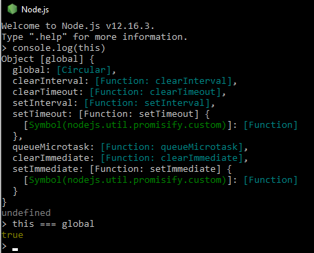

[`Programación con JavaScript`](../Readme.md) > `Sesión 01`

---

# Sesión 1:  _Scope_ _,_ _This_ _y_ _ECMAScript 6_.

🎯 **Objetivos:**

Diferenciar scope global de local y cómo this cambia dependiendo del execution context, Asi como conocer las novedades de ES6 y temas mas especificos como Strings, Destructuring, Spread Operator, Arrow functions.

---

## 💻 Tabla de Contenidos

- **[¿Qué es scope?](#qué-es-scope)**

- **[Scope global](#scope-global)**

- **[Scope local](#scope-local)**

- **[Execution context](#execution-context)**

- **[¿Cuál es el valor de `this`?](#cuál-es-el-valor-de-this)**

- **[`this` en nuevas instancias](#this-en-nuevas-instancias)**

- **[Cambiar el contexto de `this`](#cambiar-el-contexto-de-this)**

  - [Ejemplo 1: Scope y This ](./Ejemplo-01/Readme.md)

  - [Reto 1: Custom logger](./Reto-01)

- **[¿Qué es ECMAScript 6?](#qué-es-ecmascript-6)**

- **[`let` y `const`](#let-y-const)**

- **[Template strings](#template-strings)**

- **[Spread operator](#spread-operator)**

- **[Copiar iterables](#copiar-iterables)**

- **[Destructuring](#destructuring)**

  - [Ejemplo 2: ES6 Strings, Destructuring, Spread Operator. ](./Ejemplo-02/Readme.md)

  - [Reto 2: Intercambiar variables](./Reto-02/Readme.md)

- **[Arrow functions](#arrow-functions)** 
  
  - [Ejemplo 3: Arrow functions](./Ejemplo-03/Readme.md)

  - [Reto 3: Crear un número de teléfono](./Reto-03/Readme.md)

- **[Postwork](./Postwork/Readme.md)**
---

## ¿Qué es scope?

Scope es la accesibilidad que tienen las variables, funciones y objetos en partes específicas del 
código durante el tiempo de ejecución. En otras palabras, el scope determina la visibilidad de las 
variables en áreas del código.

JavaScript cuenta con dos tipos de scope: global y local. Las variables dentro de una función se 
encuentran en un scope local, aquellas definidas fuera de una función están en un scope global.
---

## Scope global

Al momento de empezar a escribir en un documento de JavaScript ya estás en un scope global y solamente 
existe uno todo el documento. Todas las variables que estén definidas fuera de una función
se encuentran en el scope global. Esto significa que se puede acceder a dichas variables e incluso 
modificarlas desde cualquier otra parte del código, incluso dentro de una función.

```javascript
var name = "John Doe";

console.log(name); // "John Doe"

function foo() {
  console.log(name); 
}

foo(); // "John Doe"
```

---

## Scope local

Las variables definidas dentro de una función se encuentran en un scope local, esto significa que
solo se puede acceder a ellas dentro de la función donde se definió la variable. Esto te permite tener
variables con el mismo nombre en distintas funciones, cada una de esas variables estará ligada a su 
respectiva función.

```javascript
function foo() {
  var name = "John Doe";
  console.log(name); 
}

foo(); // "John Doe"

console.log(name); // Uncaught ReferenceError: name is not defined
```

Sentencias de control de flujo y bucles como `if/else`, `switch`, `for` o `while` no crean un nuevo
scope como lo hacen las funciones. Cualquier variable declarada dentro de estos bloques tendrá el mismo 
scope donde se declaró la sentencia.

## Execution context

El ambiente en el cual cada línea de código es ejecutada se conoce como Execution Context. Cada vez que se llama
o ejecuta una nueva función, JavaScript crea un nuevo execution context, estos se van apilando en lo que se conoce
como Execution Stack.


Todas las variables y declaraciones de funciones por default forman parte del Global Execution Context, como es el caso
de `name`, `first`, `second`, y `third`. Al momento de ejecutar `first()` se crea un nuevo execution context encima 
del global, después de crear `var a` en este nuevo contexto se ejecuta `second()` y el proceso se repite. El contexto
que esté hasta arriba en la pila es el que se está ejecutando en el momento, una vez que la ejecución finalice se elimina
de la pila y se procede a ejecutar el que sigue, así hasta terminar.

Para evitar confusiones, el scope se refiere a la visibilidad de variables mientras que el contexto se refiere al valor
de `this`. Es decir, conforme cambia el execution context también lo hace el objeto `this`.

---

## ¿Cuál es el valor de `this`?

Ya mencionamos que la ejecución de un execution context por default es global. Esto significa que `this` por default
está haciendo referencia a un objeto global.

En un navegador o browser este objeto global es `window`.


Mientras que en un ambiente de Node.js `this` hace referencia al objeto `global`.




---

## `this` en nuevas instancias

Los function constructor nos permiten definir las propiedades de un objeto que _podría existir eventualmente_.
El constructor en sí no es un objeto. Cuando usamos el keyword `new` dicho constructor nos retorna un objeto
(instancia). En este caso `this` hace referencia al objeto instanciado.

```javascript
var Person = function(firstName, lastName) {
  this.firstName = firstName;
  this.lastName = lastName;
  
  this.logName = function() {
    console.log("Name: " + this.firstName + " " + this.lastName);
  }
}

var john = new Person("John", "Doe");
john.logName(); // Name: John Doe

var jane = new Person("Jane", "Doe");
jane.logName(); // Name: Jane Doe
```

Tenemos dos instancias de `Person` y en ambos casos `this` hace referencia a cosas distintas pese a que vienen
del mismo constructor. En el caso de `john.logName`, `this` hace referencia a `john`, un instancia de `Person` pero
que es una instancia diferente a `jane`, por lo `jane.logName` también hace referencia al objeto que lo contiene,
es decir, `jane`.

---

## Cambiar el contexto de `this`

En JavaScript las funciones son un tipo de objeto. Todas las funciones tienen los métodos `call`, `bind`, y `apply` 
que nos permiten cambiar el contexto de `this` al momento de ejecutar la función. En la sección anterior vimos cómo 
`this` cambia para cada instancia de `Person`.

```javascript
var Person = function(firstName, lastName) {
  this.firstName = firstName;
  this.lastName = lastName;
  
  this.logName = function() {
    console.log("Name: " + this.firstName + " " + this.lastName);
  }
}

var john = new Person("John", "Doe");
john.logName(); // Name: John Doe

var jane = new Person("Jane", "Doe");
jane.logName(); // Name: Jane Doe
```

Sabemos que al ejecutar `john.logName()` el contexto de `this` es `john`. Podemos llamar la misma función y darle un
nuevo contexto con el método `call`.

```javascript
john.logName.call(jane); // Name: Jane Doe
```

La única diferencia entre `call` y `apply` es la forma en que se pasan los argumentos. Con el método `call` pasamos los
argumentos separados por coma, mientras que en el caso de `apply`, el segundo argumento debe ser un arreglo con los
argumentos restantes.

El método `bind` retorna una nueva función con `this` haciendo referencia al primer argumento que se pasó.

```javascript
var showName = john.logName.bind(jane);

showName(); // Name: Jane Doe
```
#### 🕵 [Ejemplo 1: Scope y This](./Ejemplo-01/Readme.md)

## ¿Qué es ECMAScript 6?

Ecma International es una organización sin ánimos de lucro encargada de regular el funcionamiento de
varios estándares en la industria de la computación. Así surge ECMAScript 1 (ES1) en 1997 como la primera
versión del estándar de JavaScript. Normalmente se usa el término ECMAScript para referirse al estándar
y JavaScript para hablar del lenguaje en la práctica.

En 2009 se lanzó ECMAScript 5 (ES5) con muchas mejoras de las versiones anteriores. Sin embargo, a los
navegadores les tomó varios años ser compatibles con esta versión.

En 2015 surge ECMAScript 2015, que también se le conoce como ES6 o ES2015. A partir de este año se decide
lanzar una nueva versión de manera anual cambiando el número del año en cada versión, es decir, ES2016, 
ES2017, ES2018, etc.

Actualmente la versión ES5 es compatible con todos los navegadores. La versión ES6 es compatible con 
navegadores modernos. Se puede usar la mayoría de las características de ES6 mediante un proceso de 
transpiling y polyfilling que convierte el código en ES5, garantizando así la compatibilidad del código
en navegadores viejos.

---

## `let` y `const`

ES6 introduce dos nuevas formas de crear variables con `let` y `const`. La principal diferencia entre `var` y `let` es el scope. 

`let` a diferencia de `var` tiene un scope de bloque, es decir, las variables creadas con `let` solo son accesibles dentro del bloque en el que fueron declaradas.

En JavaScript todas las variables son inicializadas con `undefined` al momento de su creación.

```javascript
console.log(name); // undefined

var name = "John Doe";
```

Esta es otra diferencia entre `let` y `var`. Si se trata de acceder a una variable con `let` antes de ser declarada 
obtenemos un `ReferenceError` en lugar de `undefined`.

```javascript
console.log(name); // ReferenceError: name is not defined

let name = "John Doe";
```

`const` es muy similar a `let`, la única diferencia es que una vez asignado un valor a una variable ya no se puede 
reasignar.

```javascript
let name = 'John Doe';
const email = 'john@doe.com';

name = 'Jane Doe';
email = 'jane@doe.com'; // TypeError: Assignment to constant variable.
```

Algo muy importante es que declarar una variable con `const` no significa que esta sea inmutable, simplemente no se 
puede reasignar.

```javascript
const person = {
  name: 'John Doe'
};

person.name = 'Jane Doe';

person = {}; // TypeError: Assignment to constant variable.
```

Declarar un objeto con `const` no significa que no podamos cambiar sus propiedades, lo que no podemos hacer es 
asignarle un nuevo valor.

---

## Template Strings

Las plantillas de texto o template strings, son cadenas de texto que permiten interpolación mediante expresiones. Hacen 
mucho más fácil crear textos en los que necesitamos integrar variables o expresiones. La sintaxis consta de dos partes,
la primera es para delimitar la cadena de texto, se usan comillas invertidas. La segunda parte es para agregar
placeholders mediante el uso del signo de dólar y llaves.

```javascript
const msg = `Hello World!`;

console.log(msg); // Hello World
```
## Spread operator

El operador de propagación o spread operator hace más fácil trabajar con iterables como arreglos y objetos. La sintaxis
de este operador es `...` y se coloca justo antes de la variable.

### Copiar iterables

Uno de los usos más comunes de este operador es duplicar arreglos. Después de declarar el nombre de la variable usamos
corchetes para asignar un nuevo arreglo y dentro colocamos el spread operator para obtener todos los elementos del 
arreglo que queremos copiar.

```javascript
const colors = ['blue', 'red', 'yellow'];
const copyOfColors = [ ...colors ];

console.log(copyOfColors); // ['blue', 'red', 'yellow']
```

En el caso de objetos es casi lo mismo, la única diferencia es el uso de llaves en lugar de corchetes.

```javascript
const book = {
  author: 'Marijn Haverbeke',
  title: 'Eloquent JavaScript',
  year: 2018
};
const copyOfBook = { ...book };

console.log(copyOfBook); 
// { author: "Marijn Haverbeke", title: "Eloquent JavaScript", year: 2018 }
```
## Destructuring

Destructuring es extraer valores o propiedades de un arreglo u objeto. 

```javascript
const colors = [ 'Red', 'Blue', 'Yellow' ]

const [ red, blue, yellow ] = colors;

console.log(red); // Red
console.log(blue); // Blue
console.log(yellow); // Yellow
```

En este ejemplo estamos creando 3 variables (`red`, `blue` y `yellow`) y asignando los valores del arreglo `colors`.
Esta asignación se hace en base al index del arreglo.

```javascript
const person = {
  firstName: 'John',
  lastName: 'Doe',
  country: 'Unknown'
};

const firstName = person.firstName;
const lastName = person.lastName;

console.log(firstName, lastName); // John Doe
```

Este es un caso muy común. En ocasiones queremos crear variables a partir de propiedades de un objeto. Podemos lograr
lo mismo en una sola línea.

```javascript
const person = {
  firstName: 'John',
  lastName: 'Doe',
  country: 'Unknown'
};

const { firstName, lastName } = person;

console.log(firstName, lastName); // John Doe
```

Las llaves del lado izquierdo del `=` no son un objeto. Esta es la sintaxis de object destructuring. Estamos creando dos
nuevas variables `firstName` y `lastName`, después estamos extrayendo dos propiedades de `person` con el mismo nombre de
las variables, el valor de esas propiedades es el que se asigna a las variables creadas.

#### 🕵 [Ejemplo 2: ES6 Strings, Destructuring, Spread Operator. ](./Ejemplo-02/Readme.md)

## Arrow functions

Las funciones de flecha o arrow functions es otra de las novedades de esta versión de JavaScript. Presentan una sintaxis más concisa comparada con las funciones normales.

Veamos como funcionan y cual es su sintaxis de las Arrow functions en el siguiente ejemplo :

#### 🕵 [Ejemplo 3: Arrow functions ](./Ejemplo-03/Readme.md)


#### 🛡 [Postwork](./Postwork/Readme.md)