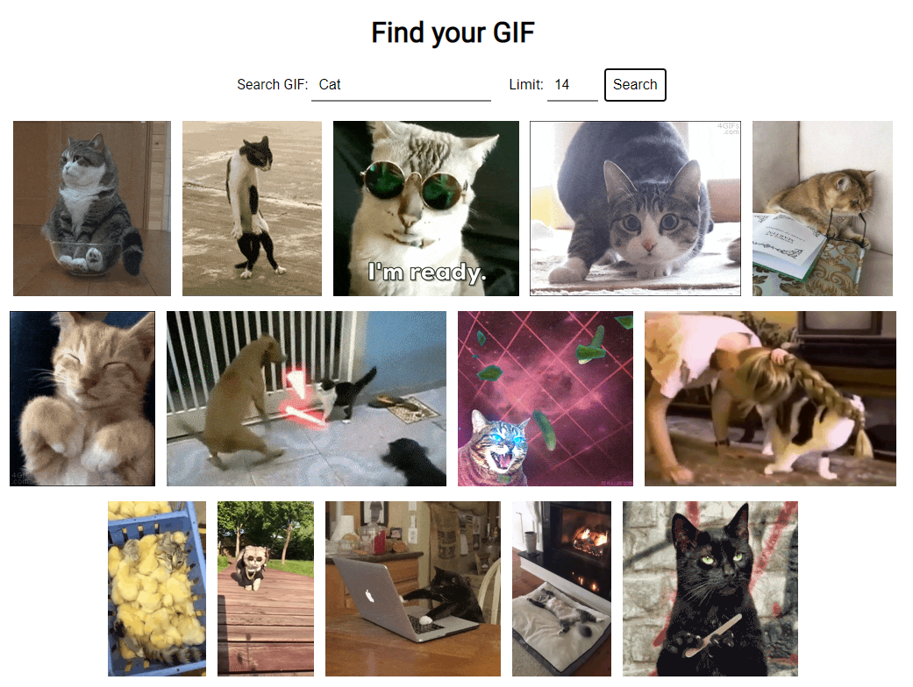

[`Programación con JavaScript`](../../Readme.md) > [`Sesión 06`](../Readme.md) > `Reto 02`

---

## Reto 2: Find your GIF II

### Objetivos

Configurar loaders para agregar estilos a proyecto de webpack

#### Requisitos

Continuar con el código generado en el [reto 1](../Reto-01/Readme.md).

#### Desarrollo

Configurar los loaders necesarios para utilizar css en caso de no haberse realizado en el reto anterior.

Agregar un nuevo input numérico, este será el valor máximo de resultados que vamos a mostrar. Realizar los cambios
necesarios para que la API de Giphy nos retorne la cantidad exacta que está especificando el usuario.

Hasta el momento, cada vez que se haga una nueva búsqueda se agregan los resultados a los ya existentes, eso hace que
la lista se extienda. Realizar los cambios necesarios para _limpiar_ los resultados antes de hacer una nueva búsqueda.

Por último, agregar estilos al proyecto de acuerdo a gusto personal. Dejar este punto al último para tener tiempo 
suficiente realizando los otros ajustes. 



<details>
  <summary>Solución</summary>

> No hay una única solución para este reto dada la flexibilidad que tiene el alumno de configurar el proyecto.

Posible estructura:

```
app
|- /dist
|- /node_modules
|- /src
|    |- /css
|        |- app.css 
|    |- /js
|        |- app.js 
|        |- apiUtil.js 
|        |- domUtil.js 
|        |- stringUtil.js 
|    |- index.html
|- package.json
|- package-lock.json
|- webpack.config.js
```

<details>
  <summary><strong>index.html</strong></summary>

```html
<!DOCTYPE html>
<html lang="es">
  <head>
    <meta charset="utf-8"/>
    <title>Find your GIF</title>
  </head>
  <body>

  <h1>Find your GIF</h1>

  <div>
    <label for="search">Search GIF:</label>
    <input type="text" id="search"/>

    <label for="limit">Limit:</label>
    <input type="number" min="1" value="9" id="limit"/>

    <button id="button">Search</button>
  </div>

  <div id="results"></div>

  </body>
</html>
```  
</details>

<details>
  <summary><strong>app.js</strong></summary>

```javascript
import { buildUrl, formatSearchString } from "./stringUtil"
import { createImage } from "./domUtil"
import { getGiphyResults } from "./apiUtil"
import '../css/app.css';

const searchInput = document.getElementById('search');
const limitInput = document.getElementById('limit');
const searchButton = document.getElementById('button');

const results = document.getElementById('results');

searchButton.addEventListener('click', searchGIFs);

function searchGIFs() {
  const search = searchInput.value;
  const limit = limitInput.value || 9;

  if(search) {
    const formattedSearch = formatSearchString(search);
    const url = buildUrl(formattedSearch, limit);

    results.innerHTML = "";

    return getGiphyResults(url)
      .then(function(gifs) {
        gifs.forEach(function(gif) {
          results.appendChild(createImage(gif.images.fixed_height.url, gif.title));
        })
      })
      .catch(function(err) {
        console.log(err)
      })
  }
}
```  
</details>

<details>
  <summary><strong>stringUtil.js</strong></summary>

```javascript
export function formatSearchString(search) {
  return search.replace(/ /g, '+');
}

export function buildUrl(search, limit) {
  const API_KEY = 'YOUR_API_KEY';
  const baseUrl = 'http://api.giphy.com/v1/gifs/search';

  return `${baseUrl}?q=${search}&api_key=${API_KEY}&limit=${limit}`;
}
```  
</details>

</details>
